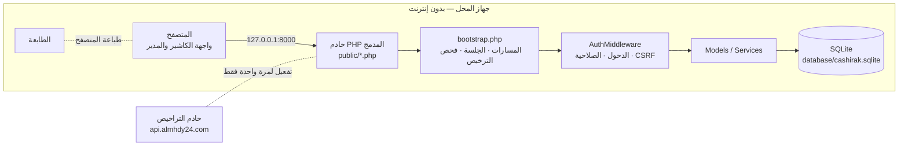
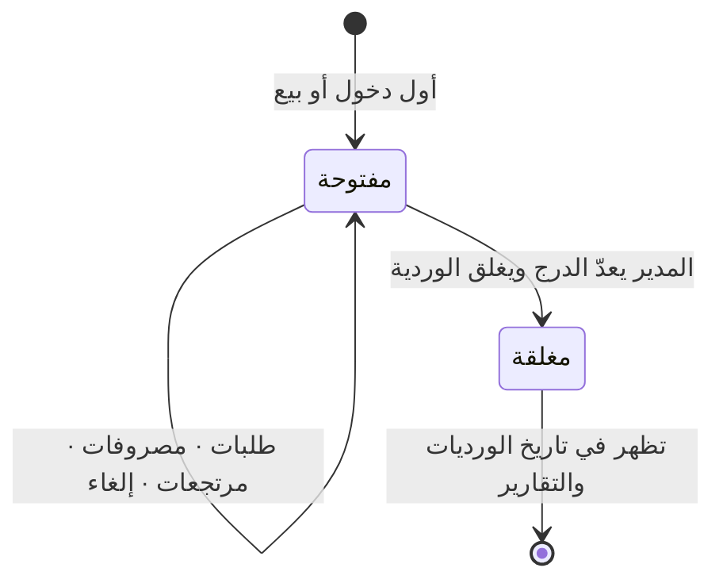

<div dir="rtl" align="right">

<div align="center">


# كاشيراك POS

**نظام نقاط بيع يعمل بدون إنترنت — للمطاعم والكافيهات والبقالات والأكشاك.**
واجهة عربية بالكامل، يعمل على أي جهاز ويندوز ولو قديم، ولا يحتاج إنترنت بعد التفعيل.

[English](README.md) · **العربية** · [الموقع](https://almhdy24.com)


</div>

---

## المحتويات

- [ما هو كاشيراك؟](#ما-هو-كاشيراك)
- [صور من النظام](#صور-من-النظام)
- [المميزات](#المميزات)
- [كيف يعمل النظام؟](#كيف-يعمل-النظام)
- [المتطلبات](#المتطلبات)
- [التثبيت](#التثبيت)
- [التشغيل لأول مرة](#التشغيل-لأول-مرة)
- [العمل اليومي](#العمل-اليومي)
- [الصلاحيات](#الصلاحيات)
- [اختصارات لوحة المفاتيح والباركود](#اختصارات-لوحة-المفاتيح-والباركود)
- [أين تُحفظ البيانات؟ والنسخ الاحتياطي](#أين-تحفظ-البيانات-والنسخ-الاحتياطي)
- [الأمان](#الأمان)
- [الصور الجاهزة للموقع](#الصور-الجاهزة-للموقع)
- [أسئلة شائعة](#أسئلة-شائعة)
- [الدعم والتواصل](#الدعم-والتواصل)

---

## ما هو كاشيراك؟

**كاشيراك** نظام كاشير متكامل مصمم للمحلات الصغيرة في السودان والمنطقة: كافيهات، مطاعم، محلات عصائر،
بقالات وأكشاك. جهاز واحد (كمبيوتر أو تابلت) يدير المحل كله:

- **الكاشير** يضغط على الأصناف، يختار طريقة الدفع (كاش، بنكك، ماي كاشي، تحويل بنكي…) ويطبع الفاتورة.
- **المدير / صاحب المحل** يدير الأصناف والمخزون والمصروفات والمستخدمين والإعدادات، ويغلق الوردية مع
  **مطابقة الدرج**، ويتابع التقارير اليومية والأسبوعية.

كل البيانات محفوظة على الجهاز في ملف SQLite واحد. لا سحابة، لا اشتراك شهري، ولا اعتماد على الشبكة —
**قطوعات الكهرباء والإنترنت لا توقف البيع.**

---

## صور من النظام

> اضغط على أي صورة لفتح النسخة بالدقة الكاملة.

### البيع

| شاشة الكاشير | قارئ الباركود |
|---|---|
| [](docs/showcase/pos-cart.png) | [](docs/showcase/pos-barcode.png) |
| **التصنيفات والبحث الفوري** | **الفاتورة المطبوعة** |
| [](docs/showcase/pos-category.png) | [](docs/showcase/receipt.png) |
| **سجل الفواتير** | **المرتجعات** |
| [](docs/showcase/history.png) | [](docs/showcase/returns.png) |

<p align="center">
  <a href="docs/showcase/devices.png"></a>
</p>

### الإدارة

| لوحة التحكم | تقارير المبيعات |
|---|---|
| [](docs/showcase/admin-dashboard.png) | [](docs/showcase/admin-reports.png) |
| **إغلاق الوردية ومطابقة الدرج** | **تاريخ الورديات** |
| [](docs/showcase/shift-close.png) | [](docs/showcase/admin-shift-history.png) |
| **تقرير وردية مفصّل** | **المصروفات** |
| [](docs/showcase/admin-shift-details.png) | [](docs/showcase/admin-expenses.png) |
| **الأصناف والتكلفة والباركود والمخزون** | **طرق الدفع** |
| [](docs/showcase/admin-add-item.png) | [](docs/showcase/admin-payment-methods.png) |
| **المستخدمون والصلاحيات** | **إعدادات المحل والفاتورة** |
| [](docs/showcase/admin-users.png) | [](docs/showcase/admin-settings.png) |
| **النسخ الاحتياطي والاستعادة** | **معالج التثبيت** |
| [](docs/showcase/admin-backup.png) | [](docs/showcase/setup-1-shop.png) |

لقطات الشاشة الخام لكل الشاشات موجودة في [`docs/screenshots/`](docs/screenshots).

---

## المميزات

### 🛒 البيع
- أزرار أصناف كبيرة تناسب اللمس، مقسمة **بتصنيفات**، مع **بحث فوري** بالاسم أو الباركود.
- **شريط الأكثر مبيعاً** ★ — أعلى 5 أصناف في الوردية بضغطة واحدة.
- سلة بأزرار **+ / −** للكمية، وإجمالي وعدّاد مباشر.
- **طريقة دفع لكل طلب**: كاش، بنكك، ماي كاشي، تحويل بنكي — ويمكن إضافة أو تعديل الطرق.
- **«إتمام البيع وطباعة»** بضغطة واحدة: يُحفظ الطلب وتفتح الفاتورة للطباعة.
- **دعم قارئ الباركود**: مسح الكود يضيف الصنف مباشرة، والكود غير المعروف يظهر تنبيه.
- الأصناف **النافدة من المخزون** تظهر باهتة ولا يمكن بيعها.
- **حماية من انقطاع الاتصال**: الطلبات تُحفظ في قائمة انتظار بالمتصفح وتُعاد محاولة إرسالها تلقائياً،
  مع **مفتاح فريد لكل طلب** يمنع تكرار الطلب.
- **التحقق من الأسعار في الخادم**: الإجمالي يُعاد حسابه من قاعدة البيانات، فلا يمكن التلاعب بالسعر.
- وضع ملء الشاشة، نافذة مساعدة، و**اختصارات لوحة مفاتيح**.

### 🧾 الفواتير والسجل والمرتجعات
- فاتورة مطبوعة باسم المحل والتاريخ ورقم الفاتورة وطريقة الدفع والأصناف والإجمالي وتذييل مخصص.
- **سجل فواتير الوردية** مع إعادة الطباعة و**الإلغاء** (الطلب الملغى يُخصم من الوردية ويُسجَّل في سجل التدقيق).
- **المرتجعات**: ابحث برقم الطلب، اختر الأصناف والكميات، السبب وطريقة رد المبلغ. كل طلب يُرجع مرة واحدة فقط.

### 💵 الورديات والدرج
- تُفتح الوردية تلقائياً مع أول دخول، وكل طلب مرتبط بوردية.
- **مصروفات الوردية** (ثلج، خبز، غاز…).
- **إغلاق الوردية مع المطابقة**: توزيع طرق الدفع، الأكثر مبيعاً، **الكاش المتوقع**
  (رصيد الافتتاح + مبيعات الكاش − المصروفات) مقابل **الكاش الفعلي**، والفرق وملاحظة.
- **تاريخ الورديات** و**تقرير مفصّل لكل وردية**.

### 📦 الأصناف والمخزون
- لكل صنف: **السعر، سعر التكلفة، الباركود، التصنيف، والمخزون (اختياري)**.
- خصم المخزون تلقائياً مع كل بيع، و**تنبيهات المخزون المنخفض والنافد** في صفحة التقارير.

### 📊 التقارير
- **اليوم**: المبيعات، عدد العمليات، متوسط الطلب، والتوزيع حسب طريقة الدفع.
- **آخر 7 أيام**: المبيعات والعمليات والمرتجعات لكل يوم.
- **تصفية بأي نطاق تاريخ**، و**تنبيهات المخزون**.

### 👥 المستخدمون والإعدادات والصيانة
- عدة مستخدمين بأدوار (**مدير / كاشير**) وصلاحيات.
- إعدادات المحل: **الاسم، العملة، تذييل الفاتورة، صيغة التاريخ**.
- **نسخ احتياطي** (تنزيل قاعدة البيانات) و**استعادة** مع حفظ نسخة أمان تلقائية قبل الاستبدال.
- **سجل تدقيق** لإنشاء وإلغاء الطلبات.

### 🖥️ المنصة
- واجهة عربية RTL، وكل الملفات (CSS/JS/أيقونات) محلية — **بدون CDN وبدون إنترنت**.
- يعمل على **ويندوز 10+** عبر مثبّت بضغطة واحدة مع PHP مدمج، أو على **لينكس / ماك / Termux**.
- يعمل على الكمبيوتر و**التابلت والجوال**.

---

## كيف يعمل النظام؟

النظام تطبيق PHP بسيط — بدون إطار عمل وبدون Composer. خادم PHP المدمج يعمل على `127.0.0.1`
(داخل الجهاز فقط)، والمتصفح هو الواجهة، وكل البيانات في ملف SQLite.



**دورة بيع الطلب:**
1. الكاشير يختار الأصناف وطريقة الدفع ويضغط «إتمام البيع وطباعة».
2. الطلب يُحفظ أولاً في قائمة انتظار بالمتصفح مع مفتاح فريد، ثم يُرسل إلى `order.php`.
3. الخادم يتحقق من المفتاح (لا تكرار)، يعيد حساب الإجمالي من أسعار قاعدة البيانات، ثم في **عملية واحدة (Transaction)**:
   يحفظ الطلب وأصنافه، يخصم المخزون، ويكتب في سجل التدقيق.
4. تُفتح الفاتورة `print.php` للطباعة. لو فشل الإرسال يبقى الطلب «معلقاً» ويُعاد إرساله تلقائياً.

**دورة الوردية:**



**الجداول الرئيسية:** `users` · `categories` · `items` · `orders` · `order_items` · `shifts` · `expenses` ·
`returns` · `return_items` · `payment_methods` · `settings` · `audit_logs`.
يُنشئ معالج التثبيت الجداول، وتُحدَّث تلقائياً عند كل تشغيل — **الترقية = استبدال ملفات البرنامج فقط**.

---

## المتطلبات

| | ويندوز (المثبّت) | لينكس / ماك / Termux |
|---|---|---|
| النظام | ويندوز 10 أو أحدث (64-بت) | أي نظام |
| PHP | مدمج — لا تحتاج تثبيت شيء | PHP **8.0+** مع `pdo_sqlite` و`openssl` و`curl` |
| المتصفح | أي متصفح حديث | نفس الشيء |
| الطابعة | أي طابعة معرّفة في النظام (حرارية أو A4) | نفس الشيء |
| الإنترنت | مرة واحدة فقط لتفعيل الترخيص | نفس الشيء |

---

## التثبيت

### الطريقة 1 — مثبّت ويندوز (الأفضل)
1. شغّل **`CashirakPOS-Setup.exe`** واتبع الخطوات.
2. افتح **Cashirak POS** من قائمة ابدأ أو سطح المكتب — يبدأ الخادم تلقائياً على أول منفذ متاح (8000–8100) ويفتح المتصفح.
3. أكمل [معالج الإعداد](#التشغيل-لأول-مرة).

ملفات البرنامج في `C:\Program Files\Cashirak POS`، و**بياناتك** في `C:\ProgramData\Cashirak POS` —
لذلك التحديث أو إعادة التثبيت لا يمس مبيعاتك.

### الطريقة 2 — نسخة محمولة لويندوز
انسخ مجلد المشروع، ضع PHP 8 (نسخة NTS zip) داخل مجلد `php\`، ثم شغّل **`start.bat`**.

### الطريقة 3 — لينكس / ماك / Termux

```bash
git clone https://github.com/almhdy24/cashirak-pos.git
cd cashirak-pos
mkdir -p storage/logs storage/sessions storage/backups database   # مجلدات البيانات
php -S 127.0.0.1:8000 -t public
```

ثم افتح <http://127.0.0.1:8000>.

---

## التشغيل لأول مرة

| الخطوة | ماذا يحدث |
|---|---|
| **1 · المحل** | فحص المتطلبات + اسم المحل، العملة، تذييل الفاتورة، صيغة التاريخ. |
| **2 · المدير** | اسم مستخدم وكلمة مرور المدير (8 أحرف على الأقل). تُنشأ قاعدة البيانات مع تصنيفات وأصناف وطرق دفع تجريبية. |
| **3 · الترخيص** | الصق مفتاح الترخيص للتفعيل (يحتاج إنترنت مرة واحدة)، أو اشترِ ترخيصاً من داخل البرنامج. |
| **4 · تم** | يُنشأ حساب **cashier** بكلمة مرور عشوائية تظهر مرة واحدة — احفظها. |

<p align="center">
  
  
  
</p>

الترخيص مربوط بالجهاز ومحمي من إرجاع ساعة الجهاز للخلف، وبعد التفعيل لا يحتاج البرنامج للإنترنت أبداً.

---

## العمل اليومي

**الكاشير**
1. سجّل الدخول ← تفتح شاشة البيع على الوردية الحالية.
2. اضغط على الأصناف (أو امسح الباركود)، عدّل الكميات، واختر طريقة الدفع.
3. اضغط **إتمام البيع وطباعة** (أو <kbd>Enter</kbd>) ← تُطبع الفاتورة.
4. من **الفواتير** أعد الطباعة، ومن **المرتجعات** نفّذ الإرجاع.

**المدير**
1. **لوحة التحكم** — أرقام الوردية مباشرة، الأصناف والمخزون والأكثر مبيعاً.
2. **المصروفات** — سجّل مصروفات الوردية.
3. **التقارير** — اليوم، آخر 7 أيام، طرق الدفع، تنبيهات المخزون، وأي فترة.
4. **إغلاق الوردية** — راجع الملخص، أدخل الكاش الفعلي في الدرج وملاحظة، ثم أغلق.
5. **النسخ الاحتياطي** — نزّل نسخة بانتظام (مثلاً على فلاش).

---

## الصلاحيات

| العملية | الكاشير | المدير |
|---|:---:|:---:|
| البيع، الطباعة، السجل، المرتجعات، إلغاء طلب | ✅ | ✅ |
| الأصناف، التصنيفات، طرق الدفع، المخزون | — | ✅ |
| المصروفات، التقارير، إغلاق وتاريخ الورديات | — | ✅ |
| المستخدمون، الإعدادات، النسخ الاحتياطي | — | ✅ |

---

## اختصارات لوحة المفاتيح والباركود

| المفتاح | الوظيفة |
|---|---|
| <kbd>F2</kbd> | التركيز على مربع البحث / الباركود |
| <kbd>Enter</kbd> | في البحث: إضافة أول نتيجة (أو الباركود المطابق) · خارج البحث: إتمام البيع |
| <kbd>Esc</kbd> | مسح السلة |

أي قارئ باركود USB يعمل ككيبورد مدعوم — فقط أدخل باركود الصنف من لوحة التحكم.

---

## أين تحفظ البيانات؟ والنسخ الاحتياطي

| نوع التثبيت | مجلد البيانات |
|---|---|
| مثبّت ويندوز | `C:\ProgramData\Cashirak POS\` |
| نسخة محمولة / لينكس | مجلد المشروع نفسه (أو `CASHIRAK_DATA_PATH`) |

- `database/cashirak.sqlite` ← **كل بياناتك** (الأصناف، الطلبات، الورديات، المستخدمون، الإعدادات).
- **النسخ الاحتياطي:** الإدارة ← النسخ الاحتياطي ← تنزيل، أو انسخ ملف `cashirak.sqlite` مباشرة.
- **الاستعادة:** ارفع ملف النسخة من نفس الصفحة؛ يحفظ النظام نسخة أمان من القاعدة الحالية قبل الاستبدال.
- **الانتقال لجهاز جديد:** ثبّت البرنامج ← استعد النسخة ← فعّل الترخيص.

---

## الأمان

- كلمات المرور مشفرة (bcrypt)، والجلسة تتجدد عند الدخول وكل 30 دقيقة.
- رمز **CSRF** لكل نموذج وطلب، وكل صفحة تتحقق من الدخول والصلاحية.
- استعلامات SQL محضّرة، وتنظيف كل المخرجات.
- الإجمالي يُحسب في الخادم، ومفتاح فريد يمنع تكرار الطلبات، وسجل تدقيق للعمليات.
- الخادم يستمع على `127.0.0.1` فقط — لا يمكن الوصول إليه من الشبكة.
- **غيّر كلمات المرور الافتراضية، واحتفظ بنسخ احتياطية دورية.**

---

## الصور الجاهزة للموقع

كل الصور في مجلد [`docs/`](docs) جاهزة للاستخدام في موقع [almhdy24.com](https://almhdy24.com) أو السوشيال ميديا:

| المجلد / الملف | المحتوى |
|---|---|
| [`docs/showcase/`](docs/showcase) | صور عرض احترافية بخلفية وهوية كاشيراك وعنوان عربي وإنجليزي (PNG بدقة 2400×1500) |
| [`docs/showcase/webp/`](docs/showcase/webp) | نفس الصور بصيغة WebP خفيفة — **استخدمها في الموقع** |
| `docs/showcase/hero.png` | بانر الصفحة الرئيسية |
| `docs/showcase/social-preview.png` | صورة 1280×640 للمشاركة (GitHub، فيسبوك، واتساب، X) |
| `docs/showcase/devices.png` | النظام على التابلت والجوال |
| [`docs/screenshots/`](docs/screenshots) | لقطات خام لكل الشاشات بدقة عالية |
| [`docs/index.html`](docs/index.html) | صفحة معرض جاهزة بالعربي والإنجليزي |

لإعادة توليد الصور بعد أي تعديل في الواجهة: `bash tools/screenshots/build.sh` (التفاصيل في [README.md](README.md#regenerating-them)).
السكربت يعمل على نسخة مؤقتة ببيانات تجريبية ولا يلمس بياناتك أو ترخيصك.

---

## أسئلة شائعة

**هل يعمل فعلاً بدون إنترنت؟**
نعم. الإنترنت مطلوب مرة واحدة فقط لتفعيل الترخيص، بعدها كل شيء يعمل محلياً.

**قطعت الكهرباء — هل ضاعت المبيعات؟**
لا. كل طلب يُحفظ في قاعدة البيانات لحظة البيع.

**ما الطابعات المدعومة؟**
أي طابعة معرّفة في الجهاز، بما فيها الطابعات الحرارية 58/80 مم.

**هل يعمل على التابلت أو الجوال؟**
نعم، الواجهة متجاوبة والأزرار مناسبة للمس.

**كيف أضيف طريقة دفع أو أغيّر العملة ونص الفاتورة؟**
الإدارة ← طرق الدفع، والإدارة ← الإعدادات.

**نسيت كلمة مرور الكاشير.**
ادخل كمدير ← المستخدمون ← تعديل الكاشير ← كلمة مرور جديدة.

---

## الدعم والتواصل

كاشيراك برنامج تجاري من **Elmahdi Dev** — © 2026، ويتطلب مفتاح ترخيص.

- 🌐 الموقع: **[almhdy24.com](https://almhdy24.com)**
- 🐞 المشاكل والاقتراحات: [GitHub Issues](https://github.com/almhdy24/cashirak-pos/issues)

<div align="center"><sub>صُنع في السودان 🇸🇩 — عشان محلك يفضل يبيع، بإنترنت أو بدونه.</sub></div>

</div>
